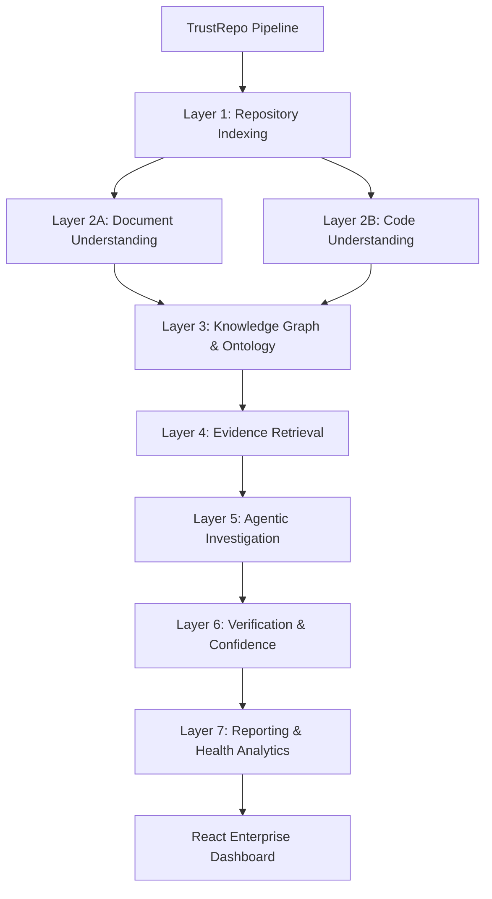

# TrustRepo

**An Enterprise-Grade, Evidence-Based Repository Intelligence & Verification Platform.**

## Abstract
TrustRepo is a novel, AI-driven framework designed to autonomously extract, investigate, and verify architectural and functional claims found within software repository documentation. By bridging the semantic gap between human-readable documentation and machine-readable code, TrustRepo builds a unified Knowledge Graph and employs a multi-agent reasoning system to independently verify claims, identify contradictions, and quantify the trustworthiness of a codebase.

## Motivation
In modern software engineering, documentation frequently drifts from the actual implementation, leading to "ghost features" (documented but missing) and "hidden features" (implemented but undocumented). Traditional static analysis tools lack the semantic understanding to verify high-level claims, while LLMs lack the deterministic rigor required for factual verification. TrustRepo was created to mathematically quantify and explain the trust gap between what a repository claims to do and what it actually does.

## Objectives
1. **Autonomous Extraction**: Automatically parse and extract verifiable claims from repository documentation.
2. **Code Understanding**: Deeply analyze source code via Abstract Syntax Trees (AST) and Unified Intermediate Representations (UIR).
3. **Unified Knowledge Representation**: Construct a Knowledge Graph linking semantic claims to code entities using centralized Ontology Registries.
4. **Independent Verification**: Deploy multi-agent systems bounded by a Confidence Engine to gather evidence and evaluate claims.
5. **Trust Quantification**: Calculate a formal Trust Score reflecting the reliability and documentation parity of the repository.

## Features
- **Multi-Language Parsing**: Supports AST extraction with an extensible `ParserRegistry`.
- **Ontology & Registries**: Centralized registries for strict knowledge management:
  - `ArchitectureRegistry`, `CapabilityRegistry`, `FeatureRegistry`, `TechnologyRegistry`, `EvidenceRegistry`, `RelationshipRegistry`.
- **Confidence Engine**: A deterministic evidence evaluation engine that weights multi-source evidence (AST, dependencies, imports) to calculate verification confidence.
- **Agentic Investigation**: Orchestrates specialized LLM agents (Investigator, Code, Documentation, Evidence Fusion, Evidence Validation) for rigorous analysis.
- **Knowledge Graph Integration**: Persists entities, relationships, and dependencies into a Neo4j graph database.
- **Explainable Reporting**: Generates human-readable, data-rich reports tracking peak memory, objects created, execution time, and research evaluation metrics.
- **Modern Enterprise Dashboard**: A highly responsive, Framer Motion-powered React frontend utilizing Recharts and ReactFlow for deep insights.

## System Architecture
TrustRepo is built on a layered architecture featuring an AI-driven, graph-based processing pipeline.

### Pipeline Flow


### Layer-wise Explanation
1. **Repository Indexing**: Detects languages, initializes the `ParserRegistry`.
2. **Document Understanding**: Extracts textual context and normalizes architectural claims into `NormalizedClaim` objects.
3. **Code Understanding**: Parses code to ASTs, builds UIRs, and extracts the `SemanticSymbolTable`.
4. **Knowledge Graph**: Fuses code and document entities using the centralized ontology engines into a Neo4j graph.
5. **Evidence Retrieval**: Aggregates multi-source evidence chains via `DependencyProvider`, `ImportProvider`, and `AnnotationProvider`.
6. **Agentic Investigation**: Multi-agent fusion and validation against the `EvidenceRegistry`.
7. **Verification & Confidence**: Calculates the Trust Score using the `ConfidenceEngine`.
8. **Reporting**: Generates the `RuntimeHealthReport` and `RepositoryHealthReport` for the UI.

## Technology Stack
### Backend
<<<<<<< HEAD
- **Framework & Validation**: FastAPI (Python 3.10+), Pydantic
=======
- **Framework**: FastAPI (Python 3.10+)
>>>>>>> 3e19abb7723094b338df85f2e0b55ce9a331f359
- **Database**: PostgreSQL (SQLAlchemy), Neo4j (Cypher)
- **Analysis**: Custom AST Parsers, LLM Agents, NetworkX
- **Telemetry**: `psutil`, custom pipeline timers

### Frontend
- **Framework**: React 19, TypeScript, Vite
- **State Management**: Zustand, React Query
- **Styling**: Tailwind CSS 4, Radix UI Primitives, Lucide React
- **Visualization**: Framer Motion (Animations), Recharts (Charts), ReactFlow (Graphs)

## Trust Verification Workflow
Agents propose findings based on retrieved evidence. The `VerificationEngine` evaluates these findings for contradictions or lack of evidence, calculating confidence scores via the `ConfidenceEngine`. A final `VerificationVerdict` (Verified, Refuted, Partial, or Insufficient) is assigned to each claim.

### Trust Score Formula
The formal trust score is calculated:
`TrustScore = Σ(wᵢ × metricᵢ) − Σ(penaltyⱼ)`

**Metrics (wᵢ):**
- Evidence Quality (w=0.25)
- Evidence Diversity (w=0.20)
- Verification Confidence (w=0.30)
- Feature Coverage (w=0.25)

**Penalties:**
- Contradiction Penalty (−20 pts per claim)
- No Evidence Penalty (−30 pts per claim)
- Missing Documentation (−5 pts per feature)

## Installation & Setup

### Prerequisites
- Python 3.10+
- Node.js 20+ & npm
- Docker & Docker Compose (for Neo4j / Postgres)

### Environment Variables
Create a `.env` file in the `backend` directory:
```env
POSTGRES_USER=trustrepo
POSTGRES_PASSWORD=trustrepo
POSTGRES_DB=trustrepo
POSTGRES_PORT=5432
NEO4J_USER=neo4j
NEO4J_PASSWORD=trustrepo
NEO4J_HTTP_PORT=7474
NEO4J_BOLT_PORT=7687
```

### 1. Start Databases
Neo4j and Postgres are managed via Docker Compose.
```bash
docker-compose up -d
```

### 2. Backend Setup
```bash
cd backend
python -m venv .venv
# Activate virtual environment
# Windows: .venv\Scripts\activate
# Unix/Mac: source .venv/bin/activate

pip install -r requirements.txt
uvicorn app.main:app --reload --port 8000
```
API Documentation is available at `http://127.0.0.1:8000/docs`.

### 3. Frontend Setup
```bash
cd frontend
npm install
npm run dev
```
Access the Enterprise Dashboard at `http://localhost:5173`.

## Project Structure
```
TrustRepo/
├── backend/
│   ├── app/
│   │   ├── api/            # FastAPI endpoints
│   │   ├── models/         # Core models, Registries, Knowledge Schemas
│   │   ├── repositories/   # Graph & SQL DB access patterns
│   │   └── services/       # Core business logic (Agents, Analysis, Knowledge)
│   └── tests/              # Pytest suite
├── docker/                 # Container configurations
├── docs/                   # Research and architecture documentation
└── frontend/               # React Enterprise Dashboard
    ├── src/
    │   ├── components/     # UI components (MetricsCards, Layouts)
    │   ├── pages/          # Dashboard, Evidence Explorer, Technologies
    │   └── store/          # Zustand state management
```

## Dashboard Overview
The TrustRepo Frontend is a premium, enterprise-grade application. It features:
- **Global Trust Score**: Interactive visualization of documentation fidelity.
- **Evidence Explorer**: Deep dive into parser-level abstract syntax tree evidence chains.
- **Runtime Dashboard**: Execution traces, memory loads, object creation metrics, and pipeline latency.
- **Technologies & Architecture**: Auto-detected stacks and architectural patterns mapped to repository capabilities.

## Testing
The backend utilizes `pytest`. To run the test suite:
```bash
cd backend
pytest tests/
```

## Performance
TrustRepo is designed to analyze mid-sized repositories (up to 50k lines of code) rapidly. Large monolithic repositories may require extended processing time due to the complexity of Knowledge Graph construction and multi-agent evidence retrieval. The `System Health & Telemetry` dashboard monitors pipeline bottlenecks in real-time.

## Future Scope
- Integration with CI/CD pipelines (e.g., GitHub Actions) to block PRs that introduce documentation drift.
- Support for C++ and Go language AST generation via the `ParserRegistry`.

## Research Limitations
- The accuracy of semantic evidence retrieval is partially dependent on the underlying LLM's context window.
- Dynamically typed languages (like JavaScript without JSDoc) yield sparser Knowledge Graphs compared to statically typed languages.

## License
<<<<<<< HEAD
[MIT License](LICENSE)
=======
[MIT License](LICENSE)
>>>>>>> 3e19abb7723094b338df85f2e0b55ce9a331f359
