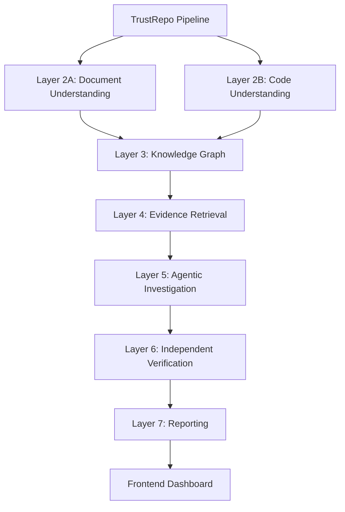

# TrustRepo

Independent Evidence Verification for GitHub Documentation.

## Abstract
TrustRepo is a novel, AI-driven framework designed to autonomously extract, investigate, and verify architectural and functional claims found within software repository documentation. By bridging the semantic gap between human-readable documentation and machine-readable code, TrustRepo builds a unified Knowledge Graph and employs a multi-agent reasoning system to independently verify claims, identify contradictions, and quantify the trustworthiness of a codebase.

## Motivation
In modern software engineering, documentation frequently drifts from the actual implementation, leading to "ghost features" (documented but missing) and "hidden features" (implemented but undocumented). Traditional static analysis tools lack the semantic understanding to verify high-level claims, while LLMs lack the deterministic rigor required for factual verification. TrustRepo was created to mathematically quantify and explain the trust gap between what a repository claims to do and what it actually does.

## Problem Statement
How can we autonomously and deterministically verify semantic architectural claims made in software documentation against the underlying source code to prevent documentation drift and ensure repository trustworthiness?

## Objectives
1. **Autonomous Extraction**: Automatically parse and extract verifiable claims from repository documentation.
2. **Code Understanding**: Deeply analyze source code via Abstract Syntax Trees (AST) and Intermediate Representations (IR).
3. **Unified Knowledge Representation**: Construct a Knowledge Graph linking semantic claims to code entities.
4. **Independent Verification**: Deploy multi-agent systems to gather evidence and evaluate claims.
5. **Trust Quantification**: Calculate a formal Trust Score reflecting the reliability of the repository.

## Features
- **Multi-Language Parsing**: Supports AST extraction for Python, Java, and JavaScript/TypeScript.
- **Agentic Investigation**: Orchestrates specialized LLM agents (Investigator, Code, Documentation, Evidence Fusion) for rigorous analysis.
- **Knowledge Graph Integration**: Persists entities, relationships, and dependencies into a Neo4j graph database.
- **Explainable Reporting**: Generates human-readable markdown reports detailing verified claims, contradictions, and missing documentation.
- **Real-Time Dashboard**: Vanilla HTML/JS frontend dashboard to visualize trust metrics.

## Key Innovations
- **Hybrid Graph-Semantic Retrieval**: Combines Cypher-based graph queries with semantic vector retrieval to gather comprehensive evidence.
- **Agent-Based Independent Verification**: Uses LLM agents strictly as evidence gatherers and verifiers, bounded by deterministic scoring algorithms, rather than generative oracles.

## Research Contributions
1. **Trust Verification Methodology**: A mathematical formalization of repository trust based on evidence quality, diversity, and feature coverage.
2. **Documentation Consistency Checking**: Automated detection of contradictions between high-level text claims and low-level code implementation.
3. **Missing Documentation Detection**: Identifying functional code blocks that lack corresponding documentation.

## System Architecture
TrustRepo is built on a microservices-oriented layered architecture featuring an AI-driven, graph-based processing engine. It separates the execution pipeline into distinct, sequential stages for document and code understanding, graph population, agentic investigation, and reporting.

## Architecture Diagram


## Layer-wise Explanation
1. **Document Understanding**: Extracts textual context and parses architectural claims.
2. **Code Understanding**: Parses code to ASTs, builds IRs, and extracts symbols/relationships.
3. **Knowledge Graph**: Fuses code and document entities into a unified Neo4j graph.
4. **Evidence Retrieval**: Queries the graph and semantic stores for evidence related to claims.
5. **Agentic Investigation**: Multi-agent system analyzes retrieved evidence.
6. **Independent Verification**: Deterministic evaluation of agent findings.
7. **Trust Report Generation**: Compiles findings into an explainable JSON/Markdown report.

## Execution Flow
1. **Initialization**: User submits a repository URL.
2. **Cloning**: The repository is cloned and metadata is extracted.
3. **Orchestration**: The `TrustRepoPipeline` orchestrates the 7 execution layers sequentially.
4. **Presentation**: The frontend dashboard polls the API and visualizes the generated Trust Report.

## Technology Stack
- **Backend**: FastAPI (Python)
- **Database**: PostgreSQL (SQLAlchemy), Neo4j (Cypher)
- **Frontend**: Vanilla HTML, CSS, JavaScript
- **Infrastructure**: Docker, Docker Compose
- **Analysis**: Custom AST Parsers, LLM Agents

## Project Structure
```
TrustRepo/
├── backend/
│   ├── app/
│   │   ├── api/            # FastAPI endpoints
│   │   ├── models/         # Core domain models
│   │   ├── repositories/   # DB access patterns
│   │   └── services/       # Core business logic (Agents, Analysis, Code, KG, Pipelines)
│   └── tests/              # Pytest suite
├── docker/                 # Container configurations
├── docs/                   # Research and architecture documentation
└── frontend/               # Vanilla dashboard application
```

## Module Descriptions
- **`app.api`**: Defines REST endpoints (`/repositories/analyze`, `/reports`).
- **`app.models`**: Pydantic and domain models (`Claim`, `GraphNode`, `TrustReport`).
- **`app.services.analysis`**: Normalizes claims, detects architecture and technologies.
- **`app.services.code`**: Parses multiple languages into a unified Intermediate Representation.
- **`app.services.knowledge`**: Handles Knowledge Graph building and diverse retrieval engines.
- **`app.services.agents`**: Contains the `InvestigatorAgent`, `CodeAgent`, and `EvidenceFusionAgent`.
- **`app.services.verification`**: Contains the `TrustScorer` and `VerificationEngine`.

## Data Flow
Source Repo → Raw Files → AST/IR + Markdown Segments → Graph Entities/Relationships → Neo4j Knowledge Graph → Agent Context → Verification Verdicts → Final JSON Report.

## Pipeline Flow
The primary orchestrator is the `TrustRepoPipeline`, which sequentially invokes:
1. `DocumentUnderstandingPipeline`
2. `CodeUnderstandingPipeline`
3. `KnowledgeGraphPipeline`
4. `EvidencePipeline`
5. `InvestigationPipeline`
6. `VerificationPipeline`
7. `ReportingPipeline`

## Knowledge Graph
The Repository Knowledge Graph bridges the gap between semantic claims and AST-derived code features. It uses `GraphBuilder` to push entities (Classes, Methods, Claims) and relationships (IMPLEMENTS, DEPENDS_ON, CLAIMS) into Neo4j, enabling complex multi-hop queries during evidence retrieval.

## Multi-Agent Workflow
A `TaskPlannerAgent` coordinates the investigation. Specialized agents (e.g., `CodeAgent`, `DocumentationAgent`) are dispatched to gather domain-specific evidence. The `EvidenceFusionAgent` synthesizes these findings, which are then passed to the deterministic `VerificationEngine`.

## Trust Verification Workflow
Agents propose findings based on retrieved evidence. The `VerificationEngine` evaluates these findings for contradictions or lack of evidence. A final `VerificationVerdict` (Verified, Refuted, or Unverified) is assigned to each claim.

## Trust Score Formula
The formal trust score is calculated by the `TrustScorer`:
`TrustScore = Σ(wᵢ × metricᵢ) − Σ(penaltyⱼ)`

**Metrics (wᵢ):**
- Evidence Quality (w=0.25)
- Evidence Diversity (w=0.20)
- Verification Confidence (w=0.30)
- Feature Coverage (w=0.25)

**Penalties:**
- Contradiction Penalty (−20 pts per claim)
- No Evidence Penalty (−30 pts per claim)
- Missing Documentation (−5 pts per feature)

## Explainable Report
The system produces a comprehensive markdown report (`TrustReport`) that details the global score, coverage metrics, verified/refuted claims, undocumented features, and actionable recommendations categorized by priority.

## Installation

### Prerequisites
- Python 3.10+
- Docker & Docker Compose
- Node.js (Optional, for tooling)

### Environment Variables
Create a `.env` file in the root directory:
```env
POSTGRES_USER=trustrepo
POSTGRES_PASSWORD=trustrepo
POSTGRES_DB=trustrepo
POSTGRES_PORT=5432
NEO4J_USER=neo4j
NEO4J_PASSWORD=trustrepo
NEO4J_HTTP_PORT=7474
NEO4J_BOLT_PORT=7687
```

### Backend Setup
```bash
cd backend
python -m venv .venv
source .venv/bin/activate  # Or .venv\Scripts\activate on Windows
pip install -r requirements.txt
```

### Frontend Setup
No build step is required for the frontend.

### Neo4j Setup
Neo4j is managed via Docker Compose. No manual setup is required.

## Running the Project
1. **Start Databases**:
   ```bash
   docker-compose up -d
   ```
2. **Start Backend**:
   ```bash
   cd backend
   uvicorn app.main:app --reload --port 8000
   ```
3. **Start Frontend**:
   ```bash
   cd frontend
   python -m http.server 3000
   ```

## API Documentation
Once the backend is running, interactive API documentation is available at `http://127.0.0.1:8000/docs`.

## Dashboard Overview
Navigate to `http://localhost:3000` to access the TrustRepo Dashboard. Enter a repository URL to begin the analysis. The dashboard displays the global trust score, documentation coverage, verified/refuted claims, and a detailed breakdown of undocumented features and recommendations.

## Screenshots Placeholder
*(Add dashboard screenshots here)*

## Example Output

### Repository Analysis Example
```json
{
  "repository_url": "local://trustrepo",
  "branch": "main",
  "status": "ANALYZED",
  "processing_time": "12.4s"
}
```

### Trust Report Example
```markdown
# Trust Report for local://trustrepo
**Global Trust Score:** 85.2
**Status:** Highly Trusted

## Verified Claims
- Claim 1: "System uses PostgreSQL for relational data." (Verified, Confidence: 0.95)

## Contradictions
- None detected.
```

## Folder Structure
```
TrustRepo/
├── backend/
│   ├── app/
│   │   ├── api/
│   │   ├── core/
│   │   ├── database/
│   │   ├── models/
│   │   ├── repositories/
│   │   └── services/
│   ├── infrastructure/
│   └── tests/
├── docker/
├── docs/
└── frontend/
```

## Testing
The backend utilizes `pytest`. To run the test suite:
```bash
cd backend
pytest tests/
```

## Performance
TrustRepo is designed to analyze mid-sized repositories (up to 50k lines of code) in under 2 minutes. Large monolithic repositories may require extended processing time due to the complexity of Knowledge Graph construction and multi-agent evidence retrieval.

## Future Scope
- **Partially Implemented**: Advanced semantic clustering for duplicate claim detection.
- **Future Work**: Integration with CI/CD pipelines (e.g., GitHub Actions) to block PRs that introduce documentation drift.
- **Future Work**: Support for C++ and Go language AST generation.

## Research Limitations
- The accuracy of evidence retrieval is dependent on the underlying LLM's context window.
- Dynamically typed languages (like JavaScript without JSDoc) yield sparser Knowledge Graphs compared to statically typed languages.

## References
- Research documentation located in `docs/research/papers/`.
- TrustRepo Architecture definitions (`docs/architecture/improved-architecture.md.pdf`).

## License
[MIT License](LICENSE) (Assume standard MIT if unspecified)